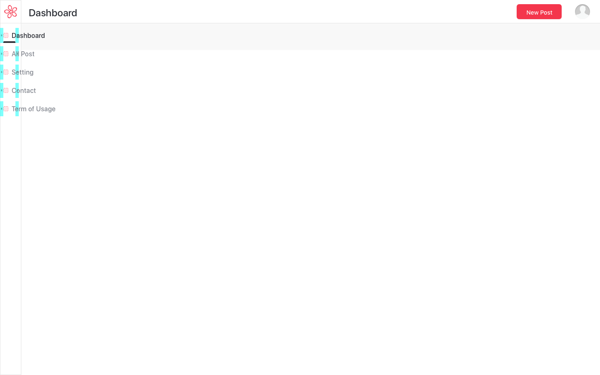
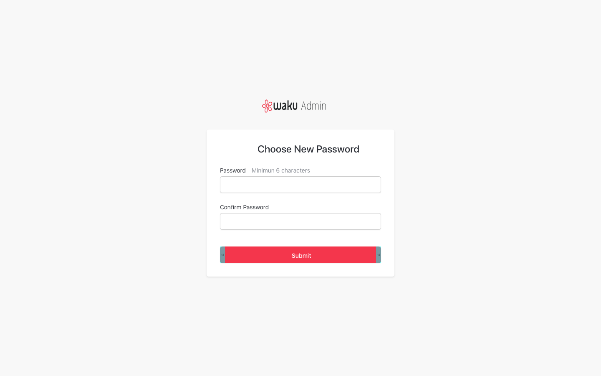
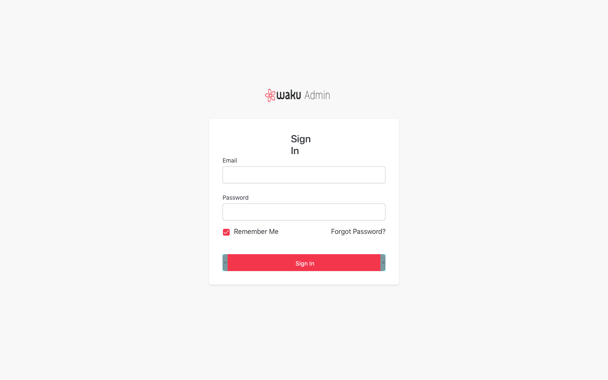
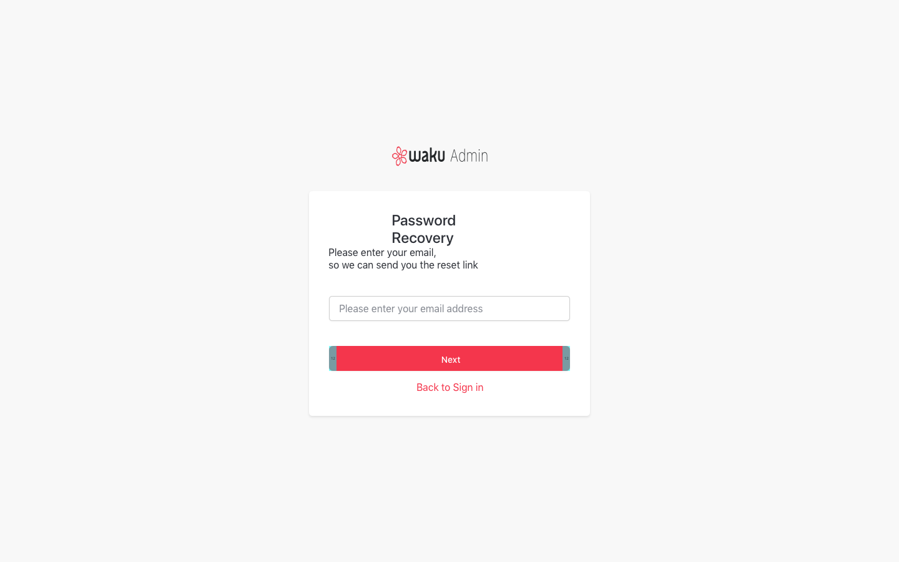
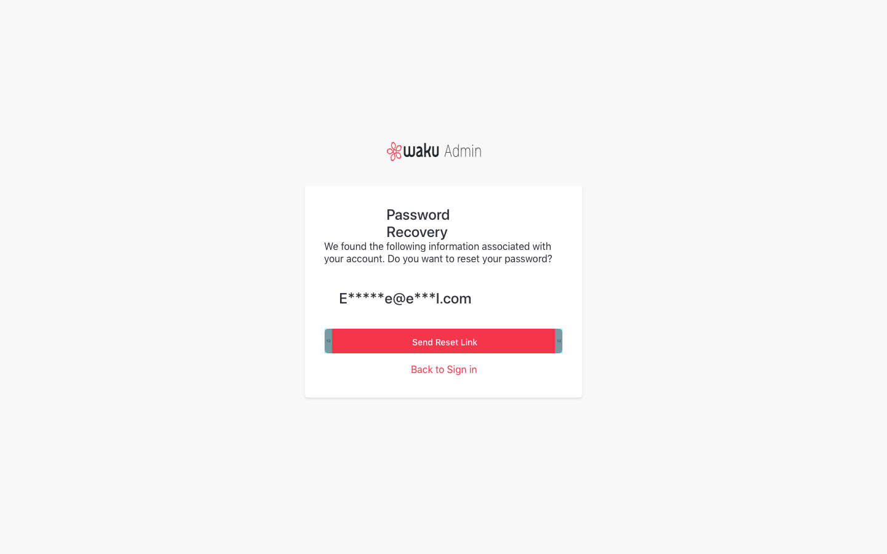
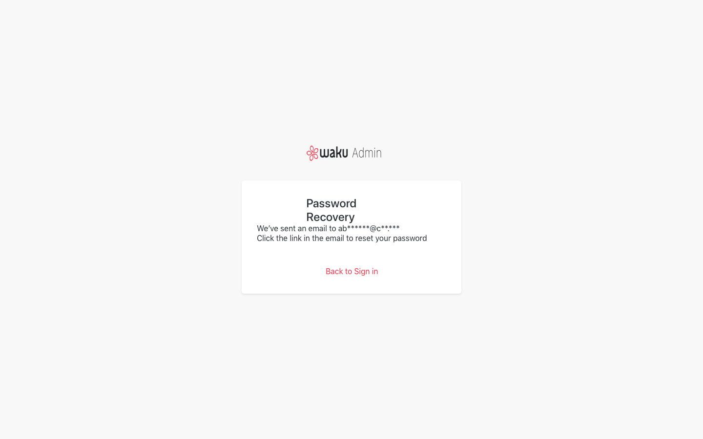

# Artboards

This is an autogenerated file showing all the artboards. Do not edit it directly.

## Admin - Dashboard

## Admin - Information - Filter Opened

## Admin - Information

## Admin - Personal Profile - Alert

## Admin - Personal Profile - Reset Pasword

## Admin - Personal Profile

## Admin - Stories 

## Admin - Stories - Filter Opened

## Admin - Stories - History Overlay

## Admin - Stories - New langauge

## Admin - Stories

## Admin - User - Download User Log

## Admin - User Overview - Delete

## Admin - Users - Administrator Permission

## Admin - Users - Alert

## Admin - Users - Edit User Alert 2

## Admin - Users - Edit User Alert

## Admin - Users - Edit User Profile

## Admin - Users - Edit User Prompt

## Admin - Users - User Permission

## Admin - Users

## Artboard

## Components  

## Desktop - 404

## Desktop - Access Denied

## Desktop - Alert

## Desktop - All Post

## Desktop - Dashboard

## Desktop - Editor 1

## Desktop - Editor 2

## Desktop - Editor

## Desktop - Login

## Desktop - Register Category 1

## Desktop - Register Category 2

## Desktop - Register Confirm

## Desktop - Setting 1

## Desktop - Setting 2

## Desktop - Setting 3

## Desktop - Terms & Agreements

## Desktop - Writer Terms

## Login Error

## Mobile - Alert

## Mobile - All Post Filter

## Mobile - All Post

## Mobile - Confirmation

## Mobile - Dashboard

## Mobile - Editor 2

## Mobile - Editor Reccomend

## Mobile - Editor

## Mobile - Login

## Mobile - Register Category 1

## Mobile - Register Category 2

## Mobile - Setting 1

## Mobile - Setting 2

## Mobile - Setting 3

## Mobile - Sidebar

## Mobile - Terms & Agreements

## Mobile - Writer Terms

## Nav 

## [Admin] Stories | All Language Approved

![[Admin] Stories | All Language Approved](./.exportedArtboards/Waku-Web/%5BAdmin%5D%20Stories%20%7C%20All%20Language%20Approved.png)

## [Admin] Stories | Approved Original Language

![[Admin] Stories | Approved Original Language](./.exportedArtboards/Waku-Web/%5BAdmin%5D%20Stories%20%7C%20Approved%20Original%20Language.png)

## [Admin] Stories | New Post

![[Admin] Stories | New Post](./.exportedArtboards/Waku-Web/%5BAdmin%5D%20Stories%20%7C%20New%20Post.png)

## [Admin] Stories | Published

![[Admin] Stories | Published](./.exportedArtboards/Waku-Web/%5BAdmin%5D%20Stories%20%7C%20Published.png)

## [Admin] Stories | Rejected Original Language

![[Admin] Stories | Rejected Original Language](./.exportedArtboards/Waku-Web/%5BAdmin%5D%20Stories%20%7C%20Rejected%20Original%20Language.png)

## [Admin] Stories | View Translated Language

![[Admin] Stories | View Translated Language](./.exportedArtboards/Waku-Web/%5BAdmin%5D%20Stories%20%7C%20View%20Translated%20Language.png)

## [Admin] Stories

![[Admin] Stories](./.exportedArtboards/Waku-Web/%5BAdmin%5D%20Stories.png)

## [Translator] Editor

![[Translator] Editor](./.exportedArtboards/Waku-Web/%5BTranslator%5D%20Editor.png)

## [Translator] Stories | Editor ⚠️

![[Translator] Stories | Editor ⚠️](./.exportedArtboards/Waku-Web/%5BTranslator%5D%20Stories%20%7C%20Editor%20%E2%9A%A0%EF%B8%8F.png)

## [Translator] Stories | New Post

![[Translator] Stories | New Post](./.exportedArtboards/Waku-Web/%5BTranslator%5D%20Stories%20%7C%20New%20Post.png)

## [Translator] Stories | Request Approval

![[Translator] Stories | Request Approval](./.exportedArtboards/Waku-Web/%5BTranslator%5D%20Stories%20%7C%20Request%20Approval.png)

## [Writer] Dashboard

![[Writer] Dashboard](./.exportedArtboards/Waku-Web/%5BWriter%5D%20Dashboard.png)

## [Writer] Editor

![[Writer] Editor](./.exportedArtboards/Waku-Web/%5BWriter%5D%20Editor.png)

## [Writer] Stories | New Post Modal

![[Writer] Stories | New Post Modal](./.exportedArtboards/Waku-Web/%5BWriter%5D%20Stories%20%7C%20New%20Post%20Modal.png)

## element

## element 

## icon

## icon_120x120

## icon_152x152

## icon_180x180

## icon_192x192

## icon_76x76

## table 

## y-1

## z-1

## z-2

## z-3

## z-4

## ⚙️ Component

## ✏️ Typography

## 🎨 Color

